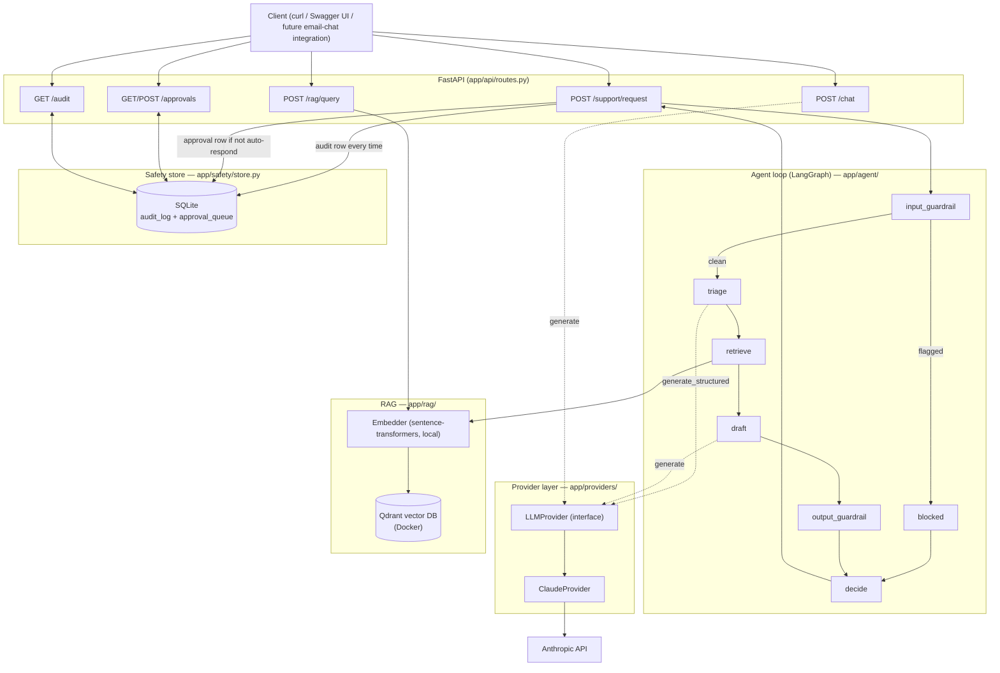

# High-Level Design

## What this system does

Given a customer support message (from email or chat — the pipeline
doesn't care which), the system:

1. **Triages** it — classifies topic and sentiment, decides if it needs a
   human.
2. **Retrieves** relevant knowledge-base excerpts.
3. **Drafts** a grounded, cited reply.
4. **Decides** what happens to that draft: send it automatically, escalate
   it to a human, or open a ticket — while two safety guardrails can
   override that decision at any point.

Every decision is logged to an audit trail, and anything not auto-sent
waits in a human-in-the-loop approval queue.

If you don't yet know what triage/RAG/guardrails/HITL mean in this
context, read [concepts.md](concepts.md) first.

## Architecture



## Component responsibilities

| Component | Responsibility | Docs |
| --- | --- | --- |
| `app/providers/` | One interface, swappable vendor implementations, for every LLM call | [provider-layer.md](low-level-design/provider-layer.md) |
| `app/rag/` | Turn the mock KB into searchable chunks; answer "what's relevant to this question" | [rag-pipeline.md](low-level-design/rag-pipeline.md) |
| `app/agent/` | Orchestrate triage → retrieve → draft → decide as an explicit state graph | [agent-loop.md](low-level-design/agent-loop.md) |
| `app/safety/` | Guardrails, audit log, human approval queue | [safety-guardrails.md](low-level-design/safety-guardrails.md) |
| `app/api/routes.py` | HTTP surface tying all of the above together | [api-reference.md](low-level-design/api-reference.md) |
| `eval/` | Judge real model quality, separate from unit tests | [eval-and-testing.md](eval-and-testing.md) |

## Request lifecycle: `POST /support/request`

```mermaid
sequenceDiagram
    participant C as Client
    participant R as routes.support_request
    participant G as LangGraph (agent graph)
    participant P as ClaudeProvider
    participant Q as Qdrant
    participant S as SafetyStore (SQLite)

    C->>R: POST /support/request {message}
    R->>G: handle_request(message)
    G->>G: input_guardrail (regex, no LLM call)
    alt injection detected
        G->>G: blocked node -> action="escalate"
    else clean
        G->>P: generate_structured (triage, forced tool-use)
        P-->>G: TriageResult {category, sentiment, needs_escalation}
        G->>Q: retrieve(message) [embed + vector search]
        Q-->>G: top-k RetrievedChunk[]
        G->>P: generate (draft, grounded in chunks)
        P-->>G: draft_response
        G->>G: output_guardrail (regex, no LLM call)
        G->>G: decide_action(triage, chunks); forced "escalate" if output flagged
    end
    G-->>R: AgentResult {triage, action, draft, flags}
    R->>S: log_audit(...)
    opt action != "respond"
        R->>S: enqueue_approval(...)
    end
    R-->>C: SupportResponse {category, action, draft_response, needs_approval, ...}
```

## Why these technology choices

| Choice | Why |
| --- | --- |
| **FastAPI** | Async-native, automatic OpenAPI docs (`/docs`), type-checked request/response models via Pydantic — minimal boilerplate for an API-first project. |
| **Claude API behind an `LLMProvider` interface** | The project only has Anthropic access today, but the interface means Azure OpenAI/OpenAI/Gemini can be added later as one new class, with zero changes to the agent loop, RAG, or routes. |
| **LangGraph over a hand-rolled function** | The pipeline was linear at first (Stage 3), which is arguably overkill for a straight line — but Stage 4 needed a genuine branch (skip triage/retrieve/draft entirely for a flagged input) and Stage 4/5 already anticipated more of this (e.g. a future HITL interrupt). A `StateGraph` with an explicit conditional edge expresses that branch directly, instead of retrofitting `if` statements into what would otherwise become an increasingly tangled function. |
| **Qdrant over Chroma** | Matches the project's Docker-based dev workflow, and its Python client supports a true in-memory mode for tests — so the exact same `QdrantVectorStore` class is used in production and in fully offline tests, no separate test-only implementation needed. |
| **sentence-transformers (local) over an embeddings API** | Zero cost, zero extra API key, works offline once the model is cached — appropriate for a project whose only paid dependency is the Claude API itself. |
| **SQLite for the safety store** | The audit log and approval queue are single-process, low-volume, and need zero setup — a full database server would be operational overhead with no real benefit at this scale. |
| **Regex/heuristic guardrails, not an LLM-based classifier** | Deterministic, free, and fast (confirmed live: an injection attempt returns in ~85ms because it never reaches the LLM at all) — appropriate as a first line of defense. See [decisions-and-limitations.md](decisions-and-limitations.md) for where this falls short and what a production system would add. |
| **No paid hosting/deployment** | This is a portfolio project with no ongoing budget; running it locally (`docker compose up` + `uvicorn`) is sufficient to demonstrate it. |

## Build history

The system was built in six stages, each committed and (mostly) live-verified
before moving to the next — see `CLAUDE.md` in the repo root for the
original stage-by-stage plan and progress notes.

1. FastAPI skeleton + provider abstraction
2. RAG layer (Qdrant + sentence-transformers + mock KB)
3. Agent loop (LangGraph: triage → retrieve → draft → decide)
4. Safety & guardrails (input/output guardrails, HITL queue, audit log)
5. Eval harness + CI/CD
6. Documentation (this folder)
