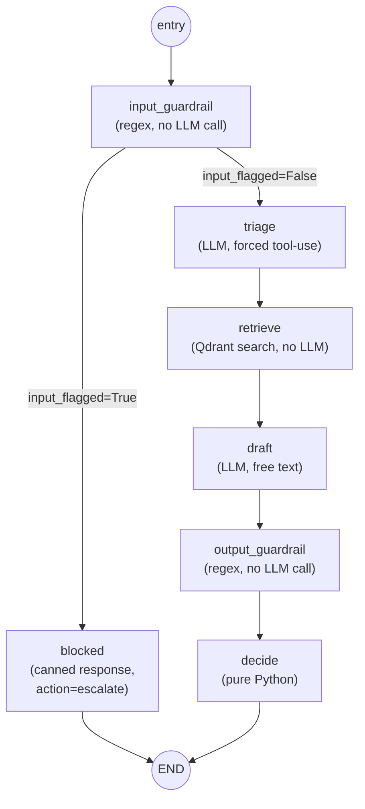

# Low-Level Design: Agent Loop

Files: [`app/agent/schemas.py`](../../app/agent/schemas.py),
[`app/agent/nodes.py`](../../app/agent/nodes.py),
[`app/agent/graph.py`](../../app/agent/graph.py),
[`app/agent/loop.py`](../../app/agent/loop.py)

If "state graph" / "node" / "conditional edge" are unfamiliar, read
[concepts.md](../concepts.md#langgraph--state-graph) first.

## The graph



Built by `build_agent_graph(provider, retrieve_fn)` in `graph.py`. It's a
**factory function**, not a plain module-level graph — it closes over
`provider` and `retrieve_fn` so the graph's nodes never need those
dependencies injected any other way. This is also exactly what makes the
graph trivially testable: build it with a fake provider and a fake
`retrieve_fn`, and every node's LLM/Qdrant calls are replaced with no
extra machinery.

## State

```python
class AgentState(TypedDict, total=False):
    message: str
    triage: TriageResult
    chunks: list[RetrievedChunk]
    draft_response: str
    action: str
    input_flagged: bool
    input_flag_reasons: list[str]
    output_flagged: bool
    output_flag_reasons: list[str]
```

`total=False` matters: not every field is set on every path through the
graph (the `blocked` path never sets `chunks` via `retrieve_node`, for
instance — it sets a hardcoded `[]` itself). Each node is an `async def
node(state) -> dict` that returns only the *fields it's updating*;
LangGraph merges that partial dict into the running state rather than
replacing it.

## Nodes, in execution order

| Node | LLM call? | What it does |
| --- | --- | --- |
| `input_guardrail` | No | Runs `check_input()` from the safety layer; sets `input_flagged`/`input_flag_reasons` |
| `blocked` *(conditional)* | No | Only reached if flagged. Sets a safe canned `draft_response`, a synthetic `TriageResult`, and `action="escalate"` directly — skips triage/retrieve/draft entirely |
| `triage` | Yes — `generate_structured` | Calls `run_triage()`, which forces Claude to classify via tool use into a `TriageResult` |
| `retrieve` | No | Calls the injected `retrieve_fn(message)` — the real one wraps `app.rag.retriever.retrieve()` against Qdrant |
| `draft` | Yes — `generate` | Calls `run_draft()`, which prompts Claude to answer using *only* the retrieved chunks, citing sources by filename |
| `output_guardrail` | No | Runs `check_output()` on the draft; sets `output_flagged`/`output_flag_reasons` |
| `decide` | No | Pure Python `decide_action()`, then force-overridden to `"escalate"` if the output guardrail flagged anything |

## The conditional edge — the actual payoff of using LangGraph

```python
graph.add_conditional_edges(
    "input_guardrail",
    lambda state: "blocked" if state["input_flagged"] else "triage",
    {"blocked": "blocked", "triage": "triage"},
)
```

This is the one genuine branch in the graph, and it's a deliberate design
decision, not an afterthought: a message that trips the input guardrail
**never reaches `triage` or `draft`**, so it costs zero Claude API calls
and can't leak into the model's context at all. This was verified live —
an injection-flagged request returned in ~85ms, versus multi-second
response times for anything that actually calls the LLM. See
[eval-and-testing.md](../eval-and-testing.md) — the eval suite's 5
injection cases are the only ones that cost no API credits, for exactly
this reason.

## `decide_action` — the routing logic

```python
def decide_action(triage: TriageResult, chunks: list[RetrievedChunk]) -> str:
    if triage.needs_escalation:
        return "escalate"
    if triage.category == "other" or not chunks:
        return "ticket"
    return "respond"
```

Plus `decide_node`'s override: `action = "escalate"` unconditionally if
`output_flagged` is set, regardless of what the line above computed. Read
as a decision table:

| `needs_escalation` | `category` | chunks found | `output_flagged` | → action |
| --- | --- | --- | --- | --- |
| any | any | any | **True** | `escalate` |
| **True** | any | any | False | `escalate` |
| False | `"other"` | any | False | `ticket` |
| False | not `"other"` | **none** | False | `ticket` |
| False | not `"other"` | **some** | False | `respond` |

This is deliberately simple, deterministic, non-LLM logic — it's the
place a human reviewer can read the entire safety policy in five lines,
rather than trusting it to another model call.

## `handle_request` — the public entrypoint

`app/agent/loop.py::handle_request(message, graph)` invokes
`graph.ainvoke({"message": message})` and maps the resulting state dict
into a typed `AgentResult` dataclass, using `.get(key, default)` rather
than `state[key]` — required because the `blocked` path never populates
several fields the "normal" path does. This is the function everything
else (the `/support/request` route, the eval harness) actually calls;
nothing outside `app/agent/` talks to the raw graph or state dict
directly.

## Extending the graph

See [extending.md](../extending.md#add-a-new-agent-node) for how to add a
new node (e.g. Stage 4's original design note: a future HITL *interrupt*
before auto-sending a `"respond"` action is a natural next branch for this
same graph).
